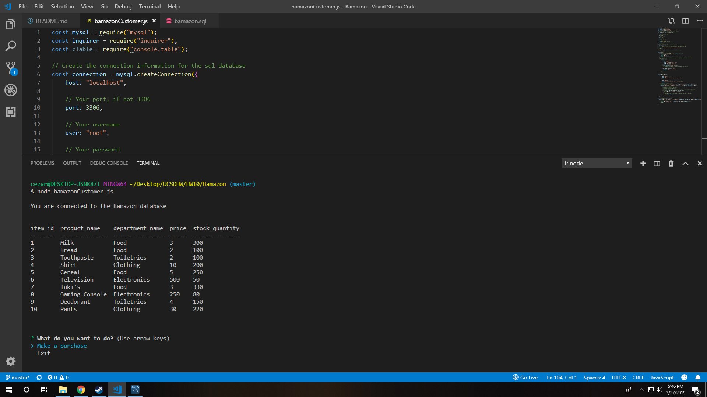
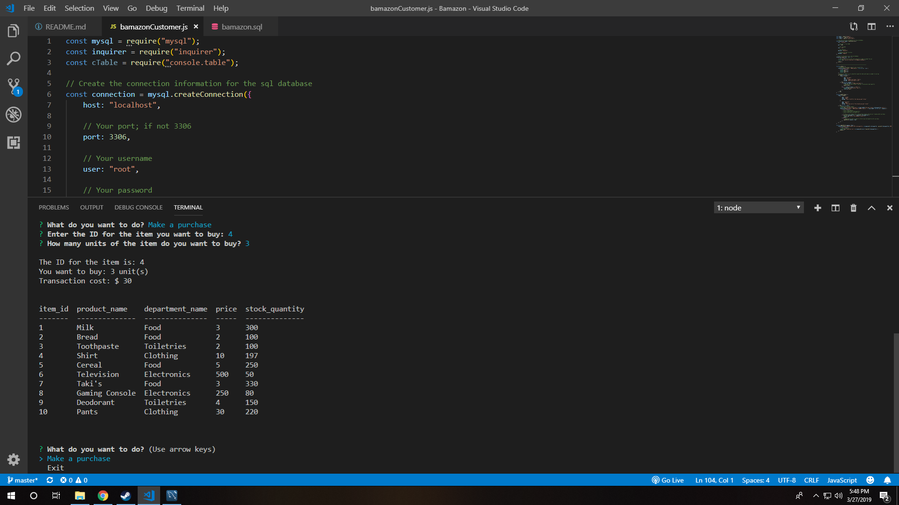
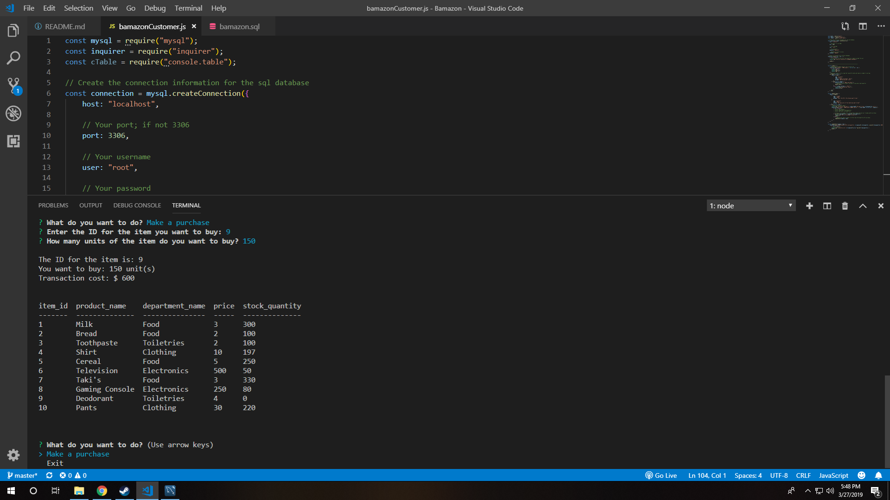
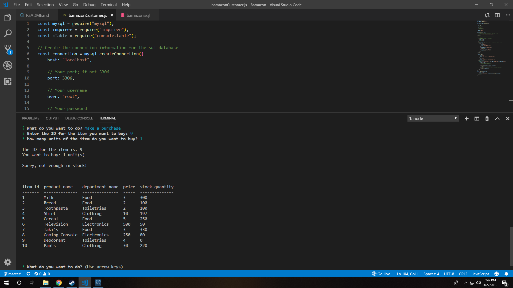
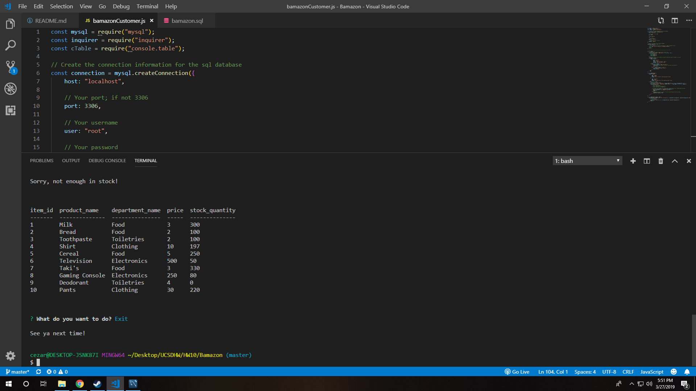

# Bamazon

This application uses Node.js and MySQL to allow the user to make mock purchases from a fictional source/database called Bamazon. 

Technologies used: 
* Node.js
* MySQL Workbench
* NPM Packages:
    * mysql
    * inquirer
    * console.table

Here are some screenshots of the application's functionality:

1. The initial prompt when first running the app.

2. Buying three shirts. The transaction cost will be displayed as well as the updated table from the MySQL database showing that the stock quantity of shirts went from 200 to 197.

3. In this case, I am buying all of the deodorant in stock because who doesn't like smelling nice and clean.

4. Now I am trying to make a new purchase of one unit of deodorant. However, the transaction will not go through because there is no more deodorant left in stock. 

5. Lastly, this is what is shown when exiting the application. 

